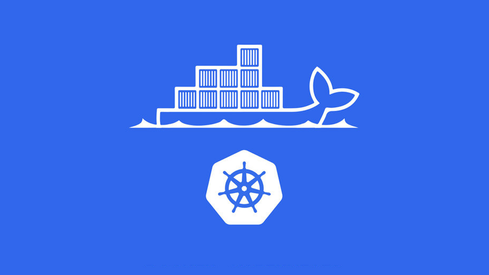
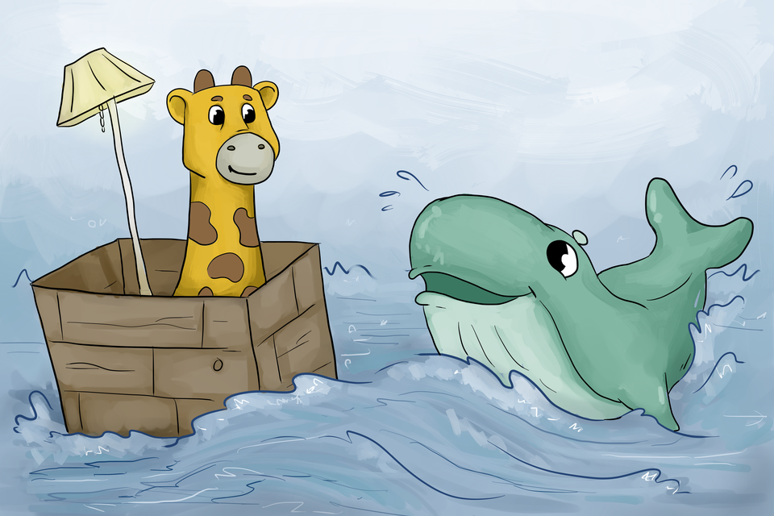
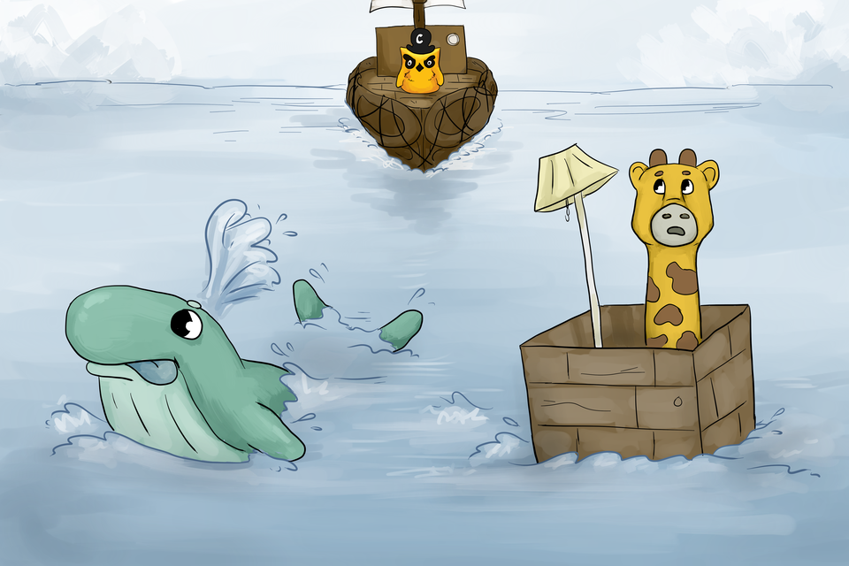
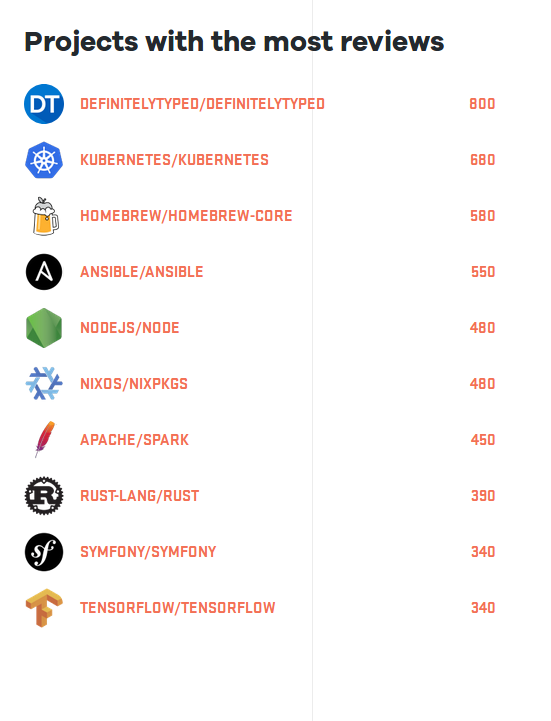
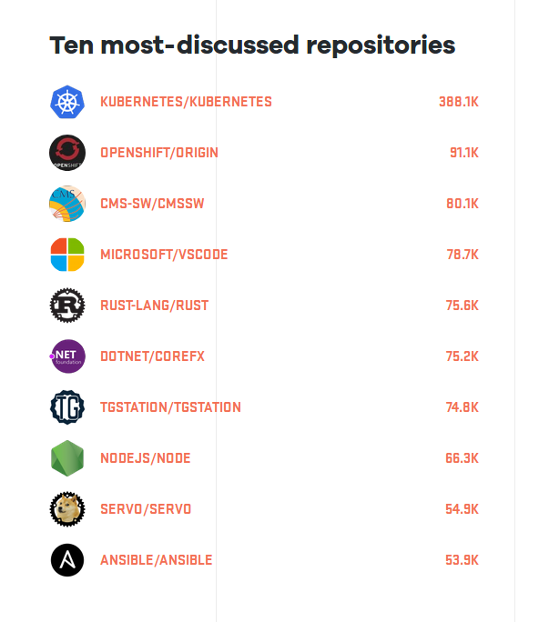
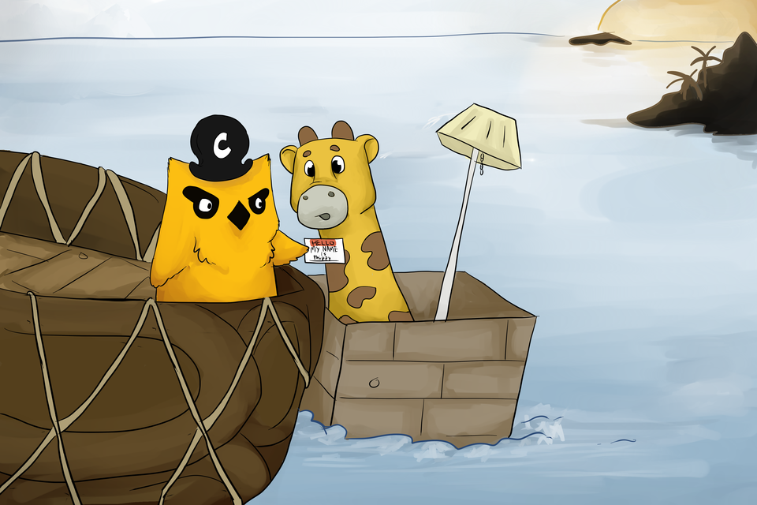
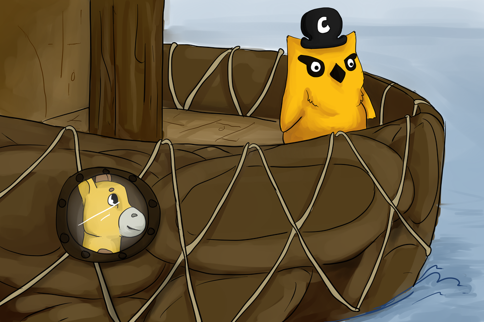
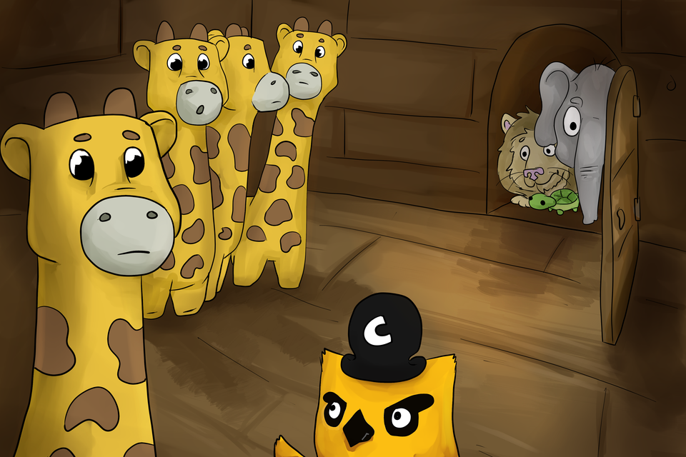
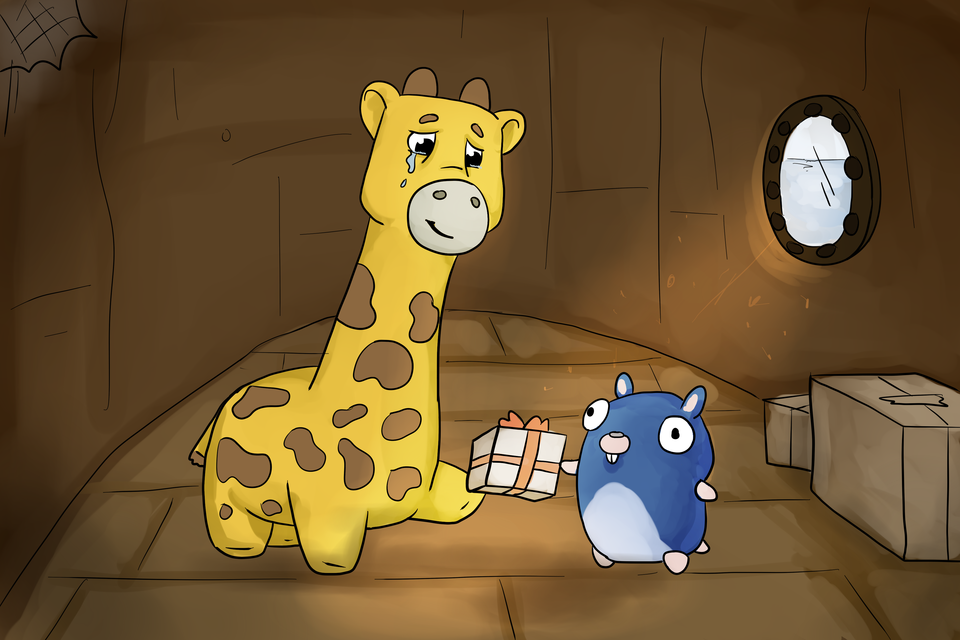
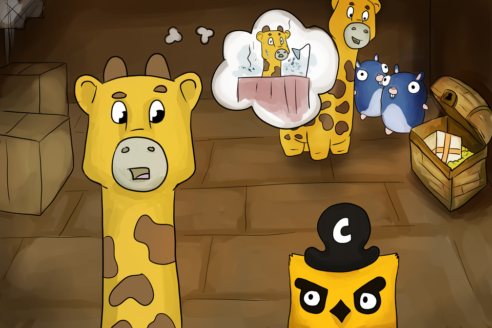

@title[Introduction]
## Kubernetes 101
##### An Introduction to Kubernetes
<!--  -->

---
@title[Recap]

## Container, Docker, Kubernetes!
A breif recap

---
@title[App]

### A basic Rails App!
<!--  -->

---
@title[Container]

## Containerizing the App!
<!--  -->

---

@title[Kubernetes]

## Kubernetes!
<!--  -->

---
@title[What is Kubernetes]

## Kubernetes!! Kubernetes!! What is this?
<!-- Available inside burger-menu. |
Start switching themes right now! -->
- Kubernetes is an **OPEN SOURCE** container orchestration software started at **Google**
- The word **Kubernetes** is a Greek work which stands for a **Ship's Captain**
- The project focuses on building a robust platform for running thousands of containers in production.
- There are other similar projects for container orchestration such as Docker Swarm, Mesos etc.

---
@title[Stats]
## Few Stats

Github Octoverse Statistics from Sep '16 to Oct '17.

---
@title[Basic Concepts]
## Concepts of Kubernetes
1. Labels
2. Pods
3. Replication Controllers
4. Services
5. Volumes
6. Namespaces
---

@title[labels]
## Labels

---

@title[pods]
## Pods

---

@title[ReplicaSets]
## Replication Controllers

---

@title[services]
## Services

---

@title[volumes]
## Volumes

---

@title[namespaces]
## Namespaces

---

@title[Setting up Kubernetes]
## Setting up Kubernetes
- Various methods depending on the Infrastructure
- Local machine
  - Minikube
  - Ubuntu on LXD
  - Kubeadm
- Cloud
  - Azure Container Service
  - Google Kubernetes Engine

 And many more solutions :grinning:.
---
@title[references]
## References
1. Presentation made using [GitPitch](https://gitpitch.com/)
2. [Kubernetes](https://kubernetes.io/)
3. [The Children's Illustrated Guide to Kubernetes](https://deis.com/blog/2016/kubernetes-illustrated-guide/)
---
@title[Get The Word Out!]

## GO FOR IT.
## JUST ADD PITCHME.md ;)
