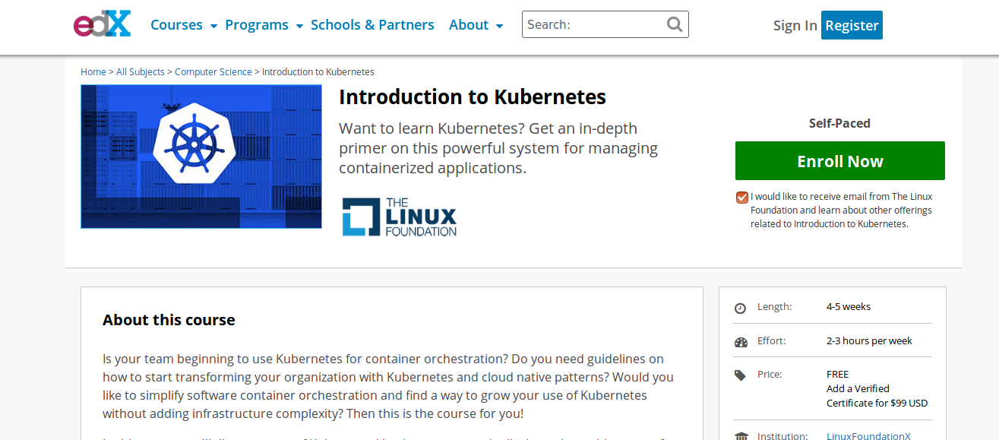

@title[Introduction]
## Kubernetes 101
##### An Introduction to Kubernetes
<!--  -->

---
@title[Recap]

## Container, Docker, Kubernetes!
A breif recap

---
@title[App]

### A basic Rails App!
<!--  -->

---
@title[Container]

## Containerizing the App!
<!--  -->

---

@title[Kubernetes]

## Kubernetes!
<!--  -->

---
@title[What is Kubernetes]

## Kubernetes!! Kubernetes!! What is this?
<!-- Available inside burger-menu. |
Start switching themes right now! -->
- Kubernetes is an **OPEN SOURCE** container orchestration software started at **Google**
- The word **Kubernetes** is a Greek work which stands for a **Ship's Captain** |
- The project focuses on building a robust platform for running thousands of containers in production. |
- There are other similar projects for container orchestration such as Docker Swarm, Mesos etc. |

---
@title[Facts1]
## Facts

Github Octoverse Statistics from Sep '16 to Oct '17.

---
@title[Facts2]
## More Facts

#### Just an heads up about, how vast Kubernetes is!!
---
@title[Basic Concepts]
## Concepts of Kubernetes
1. Labels |
2. Pods |
3. Replication Controllers |
4. Services |
5. Volumes |
6. Namespaces |
---

@title[labels]
## Labels

---

@title[pods]
## Pods

---

@title[ReplicaSets]
## Replication Controllers

---

@title[services]
## Services

---

@title[volumes]
## Volumes

---

@title[namespaces]
## Namespaces

---

@title[Setting up Kubernetes]
## Setting up Kubernetes
- Various methods depending on the Infrastructure
- Local machine
  - Minikube
  - Ubuntu on LXD
  - Kubeadm
- Cloud
  - Azure Container Service
  - Google Kubernetes Engine

 And many more solutions.
---
@title[confused]
#### Not clear?

Let's go into the demo
---
@title[demo]
## Demo
---
@title[got it]
#### Any Questions?

---
@title[Thank you.]
# Thank You!!

---
@title[references]
## References
1. Presentation made using [GitPitch](https://gitpitch.com/)
2. [Kubernetes](https://kubernetes.io/)
3. Illustrations taken from[The Children's Illustrated Guide to Kubernetes](https://deis.com/blog/2016/kubernetes-illustrated-guide/)
4. Tutorial followed - https://www.youtube.com/watch?v=F-DQeymA0Oc&list=PLj_IGCS9P2SkmHxS8-i24azCIGEneJQrA&index=6
